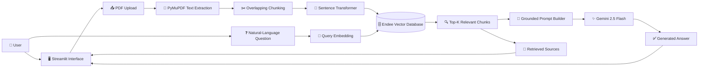
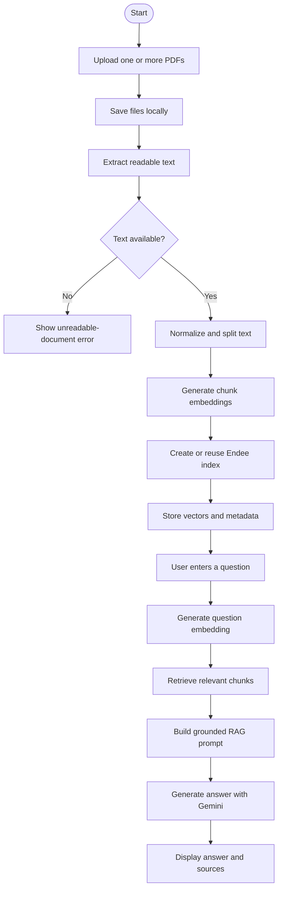

<div align="center">

# 📄 DocuMind AI

### Multi-Document RAG Assistant with Endee and Gemini

**Upload PDF documents, ask natural-language questions, and receive grounded answers with retrieved source context.**

<p>
  
  
  
  
</p>

<p>
  
  
  
</p>

[Overview](#-overview) •
[Features](#-features) •
[Architecture](#️-system-architecture) •
[Setup](#-local-setup) •
[Usage](#-how-to-use) •
[Roadmap](#-roadmap)

</div>

---

## 📌 Overview

**DocuMind AI** is a multi-document Retrieval-Augmented Generation application that allows users to upload PDF files and ask questions about their contents.

The application extracts text from each PDF, divides the text into overlapping chunks, converts the chunks into semantic embeddings, and stores them in the **Endee vector database**.

When a user asks a question, DocuMind AI retrieves the most relevant document chunks and provides them to **Gemini 2.5 Flash** to generate a grounded answer.

The interface also displays the retrieved source chunks and their similarity scores, allowing users to understand which document content supported the answer.

> **Upload → Extract → Chunk → Embed → Store → Retrieve → Generate**

---

## 🎯 Problem Statement

Finding specific information inside long documents can be slow and inefficient. Traditional keyword search may fail when the question and source document use different words to describe the same concept.

DocuMind AI improves document search by combining:

* Semantic embeddings
* Vector similarity search
* Multi-document retrieval
* Large language model generation
* Retrieved source transparency

Users can ask questions naturally instead of manually searching through every document.

---

## ✨ Features

### 📤 Multi-PDF Upload

* Upload one or more PDF files
* Process multiple documents in one operation
* Save uploaded files locally under `data/uploads`
* Display processed filenames in the current session
* Show the total number of stored chunks

### 📝 PDF Text Extraction

* Extract text using PyMuPDF
* Read document content page by page
* Combine extracted page text for processing
* Detect documents that contain no readable text

### ✂️ Overlapping Text Chunking

* Normalize unnecessary whitespace
* Split long document text into manageable chunks
* Preserve context between chunks using overlap
* Default chunk size: `700` characters
* Default overlap: `120` characters

### 🧠 Semantic Embeddings

* Generate embeddings using Sentence Transformers
* Default model: `all-MiniLM-L6-v2`
* Produce 384-dimensional vectors
* Use the same model for document chunks and questions

### 🗄️ Endee Vector Storage

* Automatically create the configured vector index
* Reuse the index when it already exists
* Use cosine similarity for vector comparison
* Store vectors using INT8 precision
* Save document name, chunk ID, and chunk text as metadata

### 🔍 Semantic Retrieval

* Convert the user's question into an embedding
* Search Endee for semantically relevant chunks
* Retrieve the five most relevant results by default
* Return document names, chunk text, and similarity values

### 🤖 Grounded Answers with Gemini

* Use the `gemini-2.5-flash` model
* Send retrieved context instead of entire documents
* Instruct Gemini not to invent unsupported information
* Return a fallback response when the answer is not present
* Keep generated responses concise and relevant

### 🔎 Source Transparency

* Display the source document for every retrieved chunk
* Show the exact retrieved text
* Display similarity values when available
* Place each source inside an expandable Streamlit panel

---

## 🛠️ Technology Stack

| Category                | Technology            |
| ----------------------- | --------------------- |
| Programming Language    | Python                |
| User Interface          | Streamlit             |
| PDF Processing          | PyMuPDF               |
| Embedding Framework     | Sentence Transformers |
| Embedding Model         | `all-MiniLM-L6-v2`    |
| Vector Database         | Endee                 |
| Similarity Metric       | Cosine similarity     |
| Vector Precision        | INT8                  |
| Generative AI           | Google Gemini         |
| Gemini Model            | `gemini-2.5-flash`    |
| Environment Management  | python-dotenv         |
| Vector Database Runtime | Docker Compose        |

---

## 🏗️ System Architecture



---

## 🔄 RAG Workflow



---

## 🧩 Project Structure

```text
documind-ai/
│
├── app.py                    # Streamlit user interface
├── config.py                 # Environment variables and RAG settings
├── requirements.txt          # Python dependencies
├── docker-compose.yml        # Endee server configuration
├── .env.example              # Example environment variables
├── test_endee.py             # Basic Endee index check
├── test_gemini_key.py        # Basic Gemini API key check
│
├── core/
│   ├── extractor.py          # PDF saving and text extraction
│   ├── chunker.py            # Overlapping text chunking
│   ├── embedder.py           # Document and query embeddings
│   ├── vector_store.py       # Endee index, insertion, and search
│   ├── prompts.py            # Grounding instructions for Gemini
│   └── rag_pipeline.py       # Retrieval and answer generation
│
└── data/
    └── uploads/              # Locally saved PDF files
```

---

## ⚙️ Configuration

The main RAG settings are defined in `config.py`.

| Setting           |                  Default Value | Purpose                    |
| ----------------- | -----------------------------: | -------------------------- |
| `GEMINI_API_KEY`  |                          Empty | Gemini authentication key  |
| `EMBED_MODEL`     |             `all-MiniLM-L6-v2` | Sentence Transformer model |
| `ENDEE_BASE_URL`  | `http://localhost:8080/api/v1` | Endee API endpoint         |
| `INDEX_NAME`      |               `documind_index` | Endee vector index name    |
| `CHUNK_SIZE`      |                          `700` | Maximum chunk length       |
| `CHUNK_OVERLAP`   |                          `120` | Shared text between chunks |
| `TOP_K`           |                            `5` | Number of retrieved chunks |
| `EMBED_DIMENSION` |                          `384` | Embedding vector dimension |

> The embedding dimension must match the selected Sentence Transformer model.

---

## 🚀 Local Setup

### Prerequisites

Install the following tools before starting:

* Python
* `pip`
* Docker and Docker Compose
* A Gemini API key

### 1. Clone the Repository

```bash
git clone https://github.com/Nithish-code17/documind-ai.git
cd documind-ai
```

### 2. Create a Virtual Environment

#### Windows

```bash
python -m venv venv
venv\Scripts\activate
```

#### macOS or Linux

```bash
python3 -m venv venv
source venv/bin/activate
```

### 3. Install Dependencies

```bash
pip install -r requirements.txt
```

### 4. Configure Environment Variables

Copy the example environment file.

#### Windows

```bash
copy .env.example .env
```

#### macOS or Linux

```bash
cp .env.example .env
```

Open the new `.env` file and add your Gemini API key:

```env
GEMINI_API_KEY=your_gemini_api_key_here
EMBED_MODEL=all-MiniLM-L6-v2
ENDEE_BASE_URL=http://localhost:8080/api/v1
INDEX_NAME=documind_index
```

> Never commit your real `.env` file or API key to GitHub.

### 5. Start the Endee Vector Database

```bash
docker compose up -d
```

The configured Endee API endpoint is:

```text
http://localhost:8080/api/v1
```

### 6. Run the Streamlit Application

```bash
streamlit run app.py
```

Open the local Streamlit URL displayed in the terminal.

---

## 🧪 Optional Checks

### Verify the Endee Index

Start the Endee container and run:

```bash
python test_endee.py
```

Expected output:

```text
Index ready: ...
```

### Verify the Gemini API Key

```bash
python test_gemini_key.py
```

> The current script displays the first ten characters of the configured key. Run it only in a private terminal and do not share its output.

---

## 📖 How to Use

1. Start the Endee service using Docker Compose.
2. Start the Streamlit application.
3. Upload one or more text-based PDF documents.
4. Select **Process Documents**.
5. Wait for extraction, chunking, embedding, and storage to finish.
6. Enter a question about the uploaded documents.
7. Select **Get Answer**.
8. Review the generated answer.
9. Expand each retrieved source to inspect its text and similarity score.

### Example Questions

```text
What are the main topics discussed in these documents?
```

```text
Summarize the recommendations mentioned in the uploaded reports.
```

```text
What risks are identified across the documents?
```

```text
Which document discusses data privacy?
```

```text
Compare the main conclusions of the uploaded reports.
```

---

## 🧠 Grounding Strategy

DocuMind AI uses a structured prompt that instructs Gemini to:

* Answer only from the retrieved context
* Avoid inventing unsupported information
* Clearly state when an answer cannot be found
* Keep responses concise and relevant
* Use short paragraphs or bullet points when suitable
* Mention source document names when helpful

When an answer is not present in the retrieved context, the expected response is:

```text
I could not find that in the uploaded documents.
```

---

## 💾 Stored Vector Metadata

Each processed document chunk is stored using the following structure:

```json
{
  "id": "document-name.pdf_0",
  "vector": ["384-dimensional embedding"],
  "meta": {
    "source": "document-name.pdf",
    "chunk_id": 0,
    "text": "Extracted document chunk"
  },
  "filter": {
    "source": "document-name.pdf"
  }
}
```

This metadata allows retrieved chunks to be connected to their original document.

---

## 🐳 Docker Configuration

The included Docker Compose configuration:

* Runs the latest Endee server image
* Exposes Endee through port `8080`
* Persists vector data in the `endee-data` volume
* Restarts the service unless it is manually stopped
* Uses rotating JSON container logs

### Stop the Endee Service

```bash
docker compose down
```

### Stop Endee and Delete Stored Vectors

```bash
docker compose down -v
```

> Removing the Docker volume permanently deletes vectors stored by the local Endee container.

---

## ⚠️ Current Limitations

* Only PDF uploads are supported.
* Image-only and scanned PDFs do not have OCR support.
* Retrieved sources are chunk-based rather than page-number-based.
* All processed documents are stored in one configured Endee index.
* Authentication and per-user document isolation are not implemented.
* **Clear Session Info** resets the Streamlit interface state but does not delete vectors from Endee.
* Reprocessing a document with the same filename reuses its chunk identifiers.
* The application does not currently provide document deletion controls.
* Automated unit and integration tests are not yet included.

---

## 🔮 Roadmap

* [ ] Add OCR for scanned PDFs
* [ ] Add page-number and paragraph-level citations
* [ ] Add document deletion controls
* [ ] Add Endee index-management tools
* [ ] Add document-specific retrieval filters
* [ ] Add authentication and user isolation
* [ ] Add separate user workspaces
* [ ] Add DOCX and TXT support
* [ ] Add conversation history
* [ ] Add streaming Gemini responses
* [ ] Add configurable chunking settings
* [ ] Add automated unit and integration tests
* [ ] Add production deployment configuration

---

## 🔐 Security Notes

* Store API credentials only inside `.env`.
* Never commit uploaded confidential documents.
* Do not expose an unauthenticated Endee server publicly.
* Avoid printing or sharing API key values.
* Add authentication and access controls before processing sensitive documents.
* Add file validation and upload-size restrictions before production deployment.

---

## 🤝 Contributing

Contributions, improvements, and suggestions are welcome.

1. Fork the repository.
2. Create a feature branch.
3. Make and test your changes.
4. Commit your changes.
5. Push the branch.
6. Open a pull request.

---

## 👨‍💻 Author

<div align="center">

### Nithish Sarwin

**Artificial Intelligence & Machine Learning Student | Java and Backend Developer**

[](https://github.com/Nithish-code17)

</div>

---

<div align="center">

**Transforming documents into searchable, grounded knowledge.**

⭐ Star the repository if you find DocuMind AI useful.

</div>
